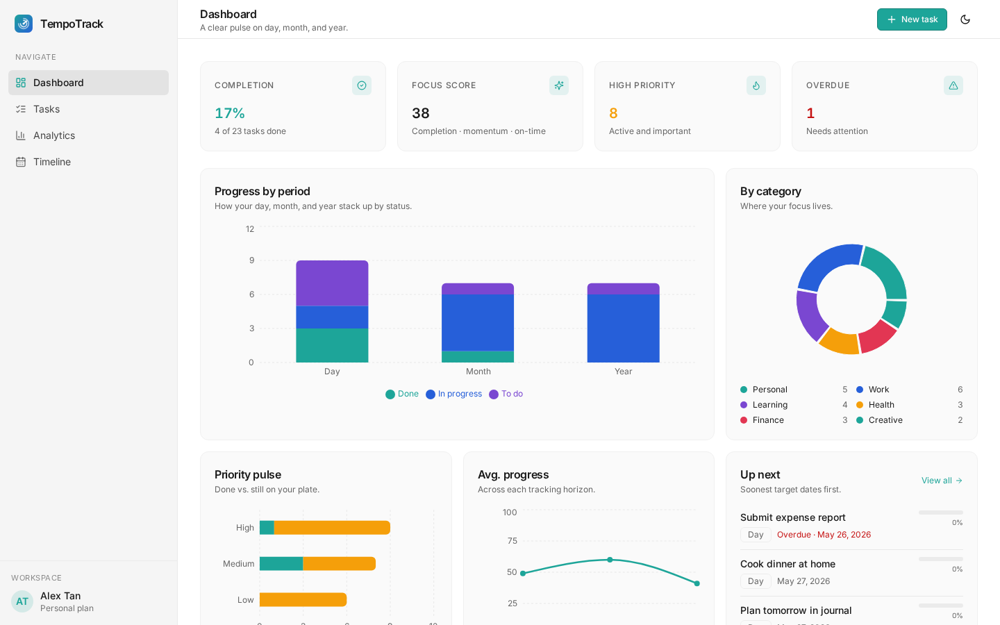
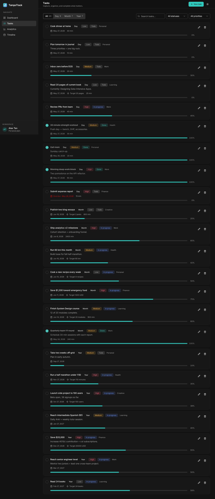
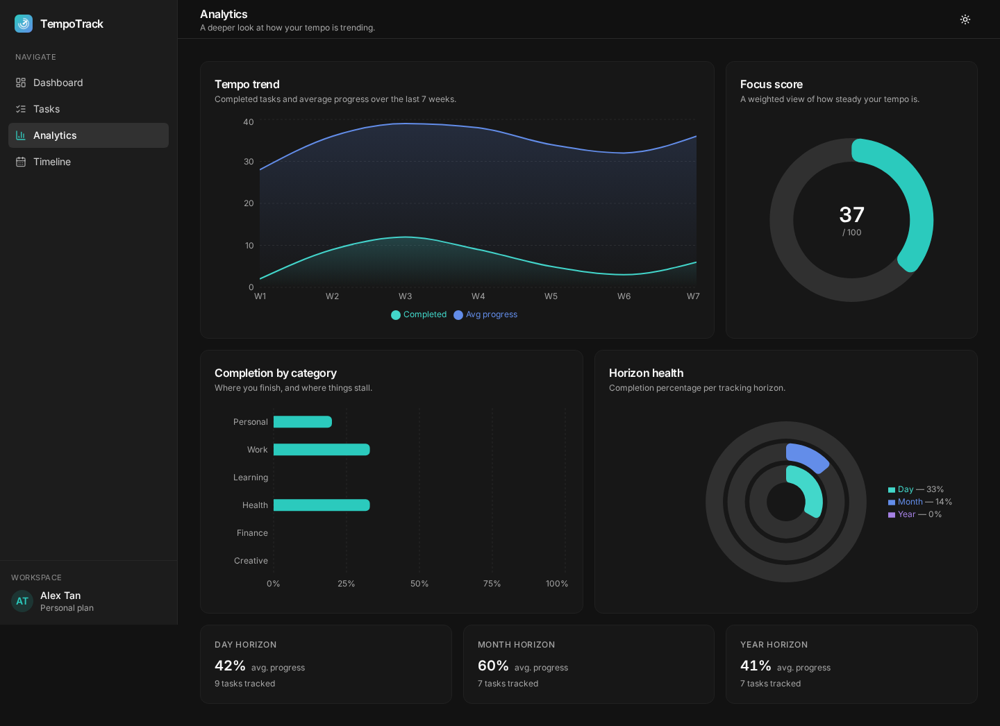
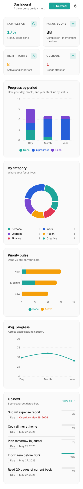

# TempoTrack

TempoTrack is a fullstack SaaS-style productivity tracker for planning and monitoring what to do during the day, month, and year. It includes private user accounts, server-side saved tracking data, dashboards, analytics charts, and a timeline view.



## Features

- **Private user accounts**: register, log in, and log out.
- **Per-user saved data**: every task belongs to one user through `user_id`.
- **Daily, monthly, and yearly tracking**: organize tasks by planning horizon.
- **Task CRUD**: create, edit, complete/reopen, delete, search, and filter tasks.
- **Dashboard KPIs**: completion rate, focus score, high priority count, and overdue count.
- **Visual analytics**: period progress, category distribution, priority pulse, average progress, completion by category, and timeline groupings.
- **Responsive UI**: desktop sidebar, mobile layout, and dark mode.
- **SQLite persistence**: simple single-file database for MVP/self-hosted deployment.

## Screenshots

### Dashboard


### Tasks



### Analytics



### Mobile



## Tech stack

- React
- Vite
- TypeScript
- Tailwind CSS
- shadcn/ui components
- Recharts
- Express
- SQLite with Drizzle ORM
- Docker-ready for Easypanel

## Demo account

The app creates a demo account on first boot:

```text
Email: demo@tempotrack.app
Password: demo123
```

You can also register new users. Each new user gets their own private workspace and starter tasks.

## Local development

Install dependencies:

```bash
npm install
```

Run the development server:

```bash
npm run dev
```

The app runs on port `5000`.

Build production files:

```bash
npm run build
```

Start production server:

```bash
npm start
```

## Environment variables

```env
NODE_ENV=production
PORT=5000
DATABASE_PATH=/data/data.db
```

`DATABASE_PATH` is optional locally. If not set, the app uses `data.db` in the project directory.

## Deploy on Easypanel

TempoTrack should be deployed as a Docker app because it has an Express backend and SQLite database.

### Easypanel steps

1. Push this project to a Git repository.
2. Open Easypanel.
3. Create a new app.
4. Select your Git repository.
5. Use **Dockerfile** as the build method.
6. Set exposed port to `5000`.
7. Add a persistent volume:
   - Mount path: `/data`
8. Add environment variables:

```env
NODE_ENV=production
PORT=5000
DATABASE_PATH=/data/data.db
```

9. Deploy the app.
10. Open the generated domain and log in with the demo account or create your own account.

## Docker

Build locally:

```bash
docker build -t tempotrack .
```

Run locally:

```bash
docker run -p 5000:5000 \
  -e NODE_ENV=production \
  -e PORT=5000 \
  -e DATABASE_PATH=/data/data.db \
  -v tempotrack-data:/data \
  tempotrack
```

Open:

```text
http://localhost:5000
```

## Data persistence

User accounts, sessions, and tasks are stored in SQLite.

When using Easypanel, the important database file is:

```text
/data/data.db
```

SQLite may also create:

```text
/data/data.db-wal
/data/data.db-shm
```

Make sure `/data` is mounted as a persistent volume. Without a persistent volume, user data may disappear after redeploys.

## Backup recommendation

Back up the `/data` volume regularly. For best safety, stop the app before copying the SQLite database, or use a SQLite-aware backup process.

## Production notes

This is ready for an MVP/self-hosted deployment, but before scaling it to many users, consider:

- Moving from SQLite to PostgreSQL.
- Adding secure HTTP-only cookie sessions.
- Adding password reset.
- Adding email verification.
- Adding admin/user management.
- Adding automated database backups.
- Adding rate limiting for auth endpoints.

## Project structure

```text
client/              React frontend
server/              Express backend and SQLite storage
shared/              Shared Drizzle/Zod schema and TypeScript types
docs/screenshots/    README screenshots
Dockerfile           Easypanel/Docker deployment
EASYPANEL.md         Short Easypanel deployment notes
```

## License

MIT
